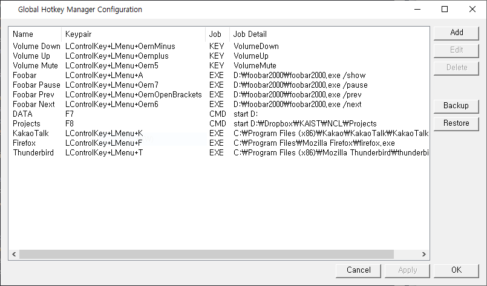

# Global Hotkey Manager
Global hotkey manager manages global hotkey on Windows system.
User can create shortcut key globally functioning wherever the key focus is.
  

## Features
- Provide global keyboard shortcuts
- Backup/Restore shortcut settings

## Tested Environment
- Windows 10
- Visual Studio 15
